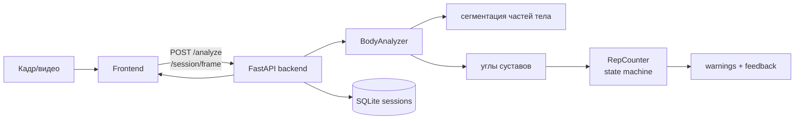
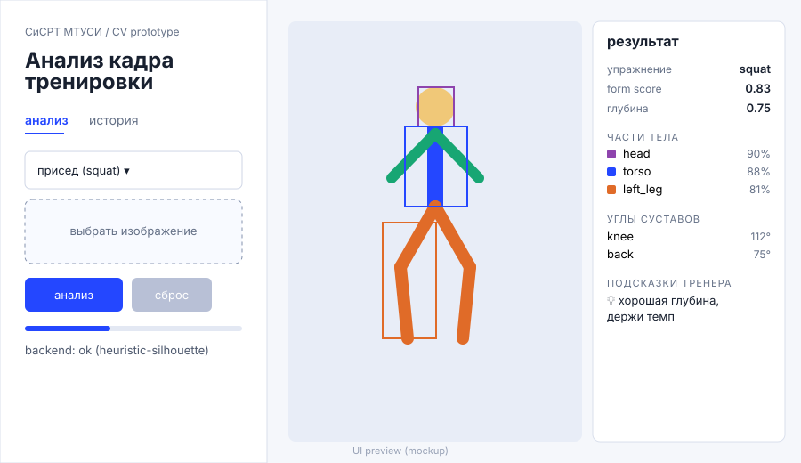

# fitnessCvApp

Desktop-прототип фитнес-приложения: ML-модуль для сегментации человека, оценки позы и подсчёта повторений.

## Что умеет

- сегментация силуэта и частей тела (YOLO segmentation, MediaPipe как baseline);
- оценка суставных углов (колено, бедро, спина, локоть);
- подсчёт повторений по кадрам через state machine (`ml/reps.py`);
- профили упражнений: **squat / lunge / push-up**;
- warnings по технике: `knee_over_toe`, `back_angle_low`, `shallow_depth`, ...;
- coach feedback - короткие подсказки;
- сессии тренировок в SQLite + история + экспорт в JSON/CSV;
- разбор видео покадрово с timeline `rep_start` / `rep_end`.

## Pipeline



## Quickstart (3 команды)

```bash
pip install -r requirements-dev.txt   # backend + tests + генерация демо-кадров
make samples                          # синтетические кадры в samples/ (для инференса без датасета)
make backend                          # FastAPI на http://127.0.0.1:8000
```

Проверить сразу, без UI:

```bash
python -m ml.predict --image samples/squat.jpg --exercise squat
```

Electron UI поверх backend:

```bash
npm install && make ui
```

## Структура

- `electron/` - desktop wrapper;
- `frontend/` - экраны анализа и истории, canvas-оверлей;
- `backend/` - FastAPI сервис (`app/main.py`), схемы, SQLite storage;
- `ml/` - инференс, углы, профили, подсчёт повторений, train scripts;
- `samples/` - маленькие синтетические кадры + генератор;
- `tests/` - pytest на API и ML;
- `docs/` - dataset, training, model card, сравнение подходов;
- `notebooks/` - рабочие ML notebooks.

## API

| endpoint | метод | назначение |
|---|---|---|
| `/health` | GET | статус + имя модели |
| `/analyze` | POST | анализ одного кадра |
| `/session/start` | POST | начать сессию (exercise) |
| `/session/frame` | POST | кадр в сессию, счёт повторений |
| `/session/{id}/finish` | POST | завершить сессию |
| `/sessions` | GET | история тренировок |
| `/sessions/{id}/export` | GET | экспорт JSON/CSV |
| `/analyze-video` | POST | разбор видео + timeline |

## ML

Основная модель - YOLO segmentation checkpoint `ml/weights/body_parts_yolo.pt`

```bash
python -m ml.train --config ml/configs/body_parts.yaml   # печатает команду yolo train
python -m ml.predict --image samples/squat.jpg           # инференс одного кадра
```

Почему YOLO segmentation, а не Pose Landmarker - см.
[docs/model_card.md](docs/model_card.md) и
[docs/pose_vs_yolo.md](docs/pose_vs_yolo.md).

## How to build

```bash
make test    # pytest
make lint    # компиляция python
make smoke   # поднять backend и дёрнуть /health + /analyze
make docker-up   # backend в docker (см. docker-compose.yml)
```


