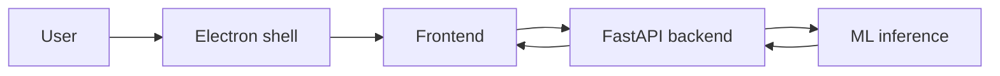

# Архитектура приложения

## Electron

Открывает локальный HTML frontend. Нужен, чтобы приложение выглядело как
desktop app и не зависело от браузера пользователя.

## Frontend

Загружает изображение, отправляет его на `/analyze`, рисует bbox частей тела на
canvas и показывает JSON-ответ.

## Backend

FastAPI сервис. Endpoint:

- `GET /health`;
- `POST /analyze` с multipart file `image`.

## ML

Модуль `ml/inference.py` скрывает модель от backend. Если весов YOLO нет,
возвращается mock-ответ той же формы, чтобы можно было проверить frontend.
