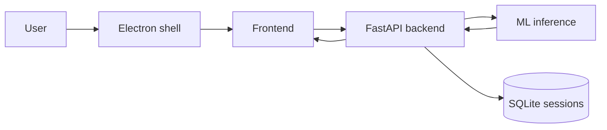

# Архитектура приложения

## Electron

Открывает локальный HTML frontend. Нужен, чтобы приложение выглядело как
desktop app и не зависело от браузера пользователя.

## Frontend

Два экрана (табы):

- **анализ** - загрузка кадра, оверлей частей тела на canvas, углы, warnings,
  подсказки тренера;
- **история** - список сессий из `/sessions`, ссылки на CSV-экспорт.

При старте пингует `/health`. Если backend не поднят - показывает баннер
«backend недоступен» и кнопку «повторить».

## Backend

FastAPI сервис (`backend/app/main.py`). Основные endpoint'ы:

- `GET /health`;
- `POST /analyze` - один кадр;
- `POST /session/start`, `POST /session/frame`, `POST /session/{id}/finish`;
- `GET /sessions`, `GET /sessions/{id}`, `GET /sessions/{id}/export`;
- `POST /analyze-video`.

Сессии хранятся в SQLite (`backend/app/storage.py`). Счётчики повторений
(`RepCounter`) живут в памяти процесса, привязаны к `session_id`.

## ML

Модуль `ml/` скрывает модель от backend:

- `inference.py` - `BodyAnalyzer`, части тела + оценка глубины из силуэта;
- `angles.py` - суставные углы по keypoints;
- `profiles.py` - профили упражнений, пороги, правила warnings;
- `reps.py` - state machine подсчёта повторений (гистерезис up/down);
- `feedback.py` - короткие подсказки по технике.

Если весов YOLO нет, `BodyAnalyzer` работает в эвристическом режиме и возвращает
ответ той же формы, чтобы frontend/сессии работали без GPU.
